# 1.20模组开发文档

## 一、下载配置环境

#### 1、下载JDK

[Java Downloads | Oracle 中国](https://www.oracle.com/cn/java/technologies/downloads/#jdk17-windows)

#### 2、下载IDEA

[Download IntelliJ IDEA – The Leading Java and Kotlin IDE (jetbrains.com)](https://www.jetbrains.com/idea/download/?section=windows)

#### 3、下载MDK

[Downloads for Minecraft Forge for Minecraft 1.20.1](https://maven.minecraftforge.net/net/minecraftforge/forge/1.20.1-47.2.20/forge-1.20.1-47.2.20-mdk.zip)

**下载完是ZIP的压缩文件**


**移动到要开发的项目下**


**解压出来**

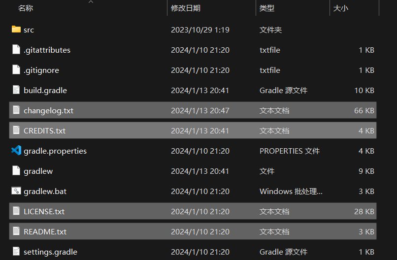

以下是可删除文件

#### 4、环境配置

##### 4.1**使用IDEA打开项目**

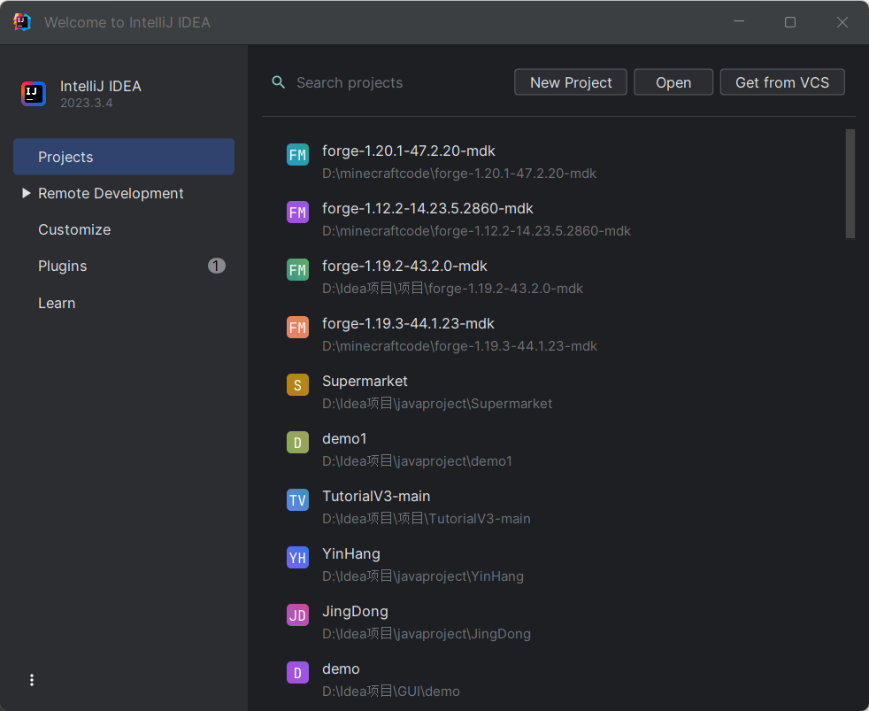

**点击打开项目**


**选择解压好的MDK项目**

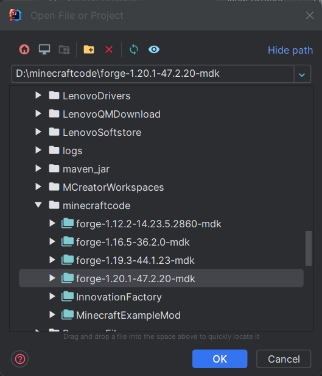

**等待项目构建Build完成**

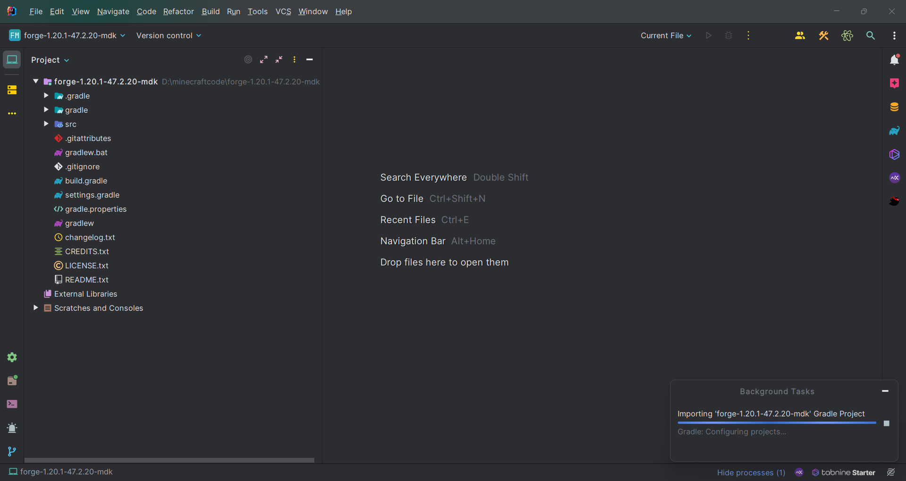

**如果出现报错请重新尝试**

##### 4.2配置IDEA

**点击左上角File下的Project Structure**

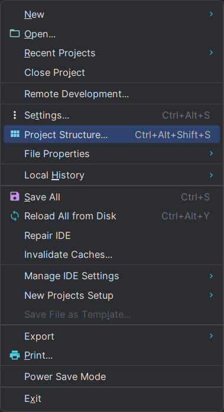

**确保下面和你的JDK版本一致**

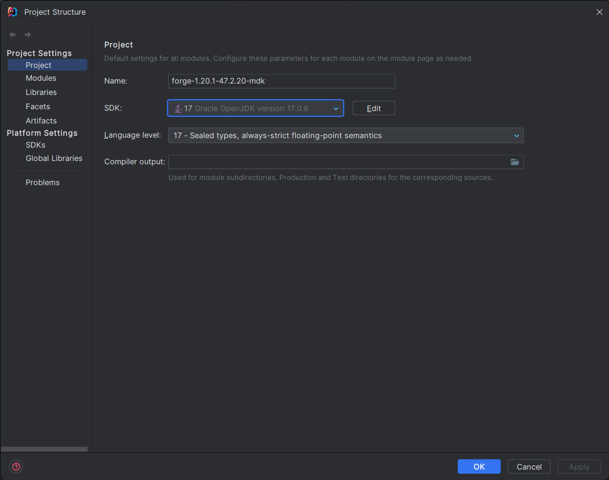

**再次点击File下的settings**

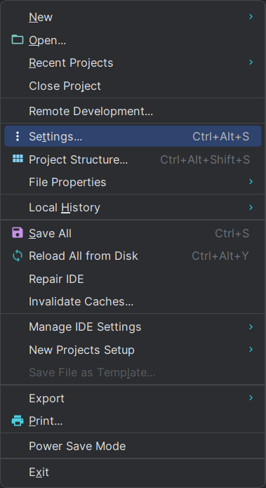

查看JVM是否是你JDK的当前版本

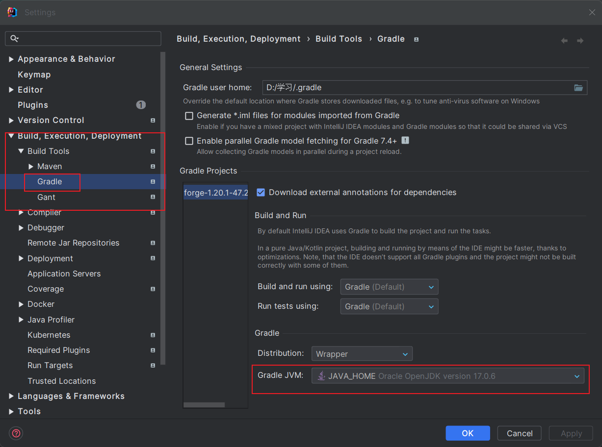

##### 4.3配置修改模组的信息

**根据一下的路径找到ExampleMod类**

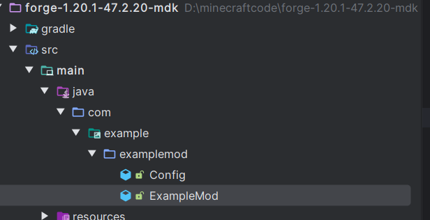

**修改包名**

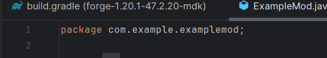

**选中按下Shift+F6**

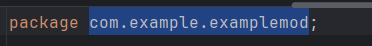

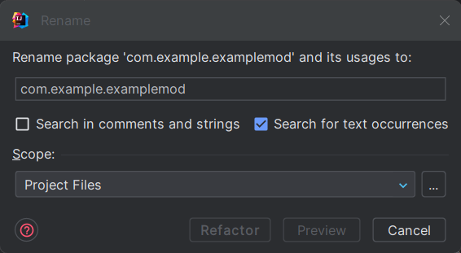

**可以修改为域名.作者名.模组名**

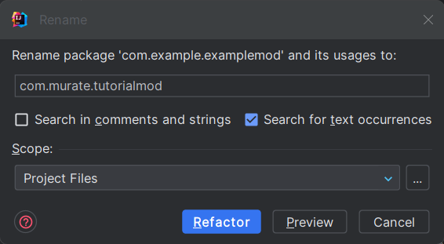

**修改完点击下面的Refactor**

**修改后的文件夹**

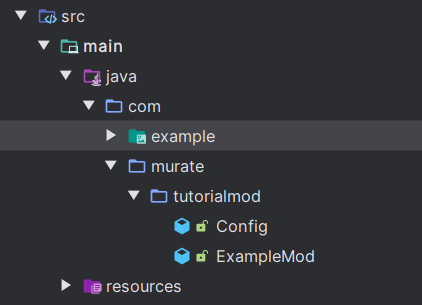

**再次点击ExampleMod进行修改类名**

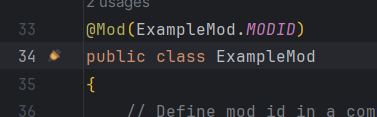

**按下Shift+F6修改为自己的模组名**

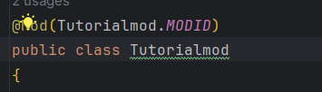

**找到这一行**

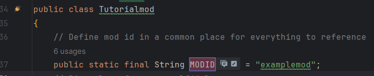

**修改为**


**将文件不用部分进行删除**

```java
package com.murate.tutorialmod;

import com.mojang.logging.LogUtils;
import net.minecraft.client.Minecraft;
import net.minecraft.core.registries.Registries;
import net.minecraft.world.food.FoodProperties;
import net.minecraft.world.item.BlockItem;
import net.minecraft.world.item.CreativeModeTab;
import net.minecraft.world.item.CreativeModeTabs;
import net.minecraft.world.item.Item;
import net.minecraft.world.level.block.Block;
import net.minecraft.world.level.block.Blocks;
import net.minecraft.world.level.block.state.BlockBehaviour;
import net.minecraft.world.level.material.MapColor;
import net.minecraftforge.api.distmarker.Dist;
import net.minecraftforge.common.MinecraftForge;
import net.minecraftforge.event.BuildCreativeModeTabContentsEvent;
import net.minecraftforge.event.server.ServerStartingEvent;
import net.minecraftforge.eventbus.api.IEventBus;
import net.minecraftforge.eventbus.api.SubscribeEvent;
import net.minecraftforge.fml.ModLoadingContext;
import net.minecraftforge.fml.common.Mod;
import net.minecraftforge.fml.config.ModConfig;
import net.minecraftforge.fml.event.lifecycle.FMLClientSetupEvent;
import net.minecraftforge.fml.event.lifecycle.FMLCommonSetupEvent;
import net.minecraftforge.fml.javafmlmod.FMLJavaModLoadingContext;
import net.minecraftforge.registries.DeferredRegister;
import net.minecraftforge.registries.ForgeRegistries;
import net.minecraftforge.registries.RegistryObject;
import org.slf4j.Logger;

// The value here should match an entry in the META-INF/mods.toml file
@Mod(Tutorialmod.MOD_ID)
public class Tutorialmod
{
    // Define mod id in a common place for everything to reference
    public static final String MOD_ID = "tutorialmod";
    // Directly reference a slf4j logger
    private static final Logger LOGGER = LogUtils.getLogger();
    // Create a Deferred Register to hold Blocks which will all be registered under the "examplemod" namespace
    public static final DeferredRegister<Block> BLOCKS = DeferredRegister.create(ForgeRegistries.BLOCKS, MOD_ID);
    // Create a Deferred Register to hold Items which will all be registered under the "examplemod" namespace
    public static final DeferredRegister<Item> ITEMS = DeferredRegister.create(ForgeRegistries.ITEMS, MOD_ID);
    // Create a Deferred Register to hold CreativeModeTabs which will all be registered under the "examplemod" namespace
    public static final DeferredRegister<CreativeModeTab> CREATIVE_MODE_TABS = DeferredRegister.create(Registries.CREATIVE_MODE_TAB, MOD_ID);

    // Creates a new Block with the id "examplemod:example_block", combining the namespace and path
    public static final RegistryObject<Block> EXAMPLE_BLOCK = BLOCKS.register("example_block", () -> new Block(BlockBehaviour.Properties.of().mapColor(MapColor.STONE)));
    // Creates a new BlockItem with the id "examplemod:example_block", combining the namespace and path
    public static final RegistryObject<Item> EXAMPLE_BLOCK_ITEM = ITEMS.register("example_block", () -> new BlockItem(EXAMPLE_BLOCK.get(), new Item.Properties()));

    // Creates a new food item with the id "examplemod:example_id", nutrition 1 and saturation 2
    public static final RegistryObject<Item> EXAMPLE_ITEM = ITEMS.register("example_item", () -> new Item(new Item.Properties().food(new FoodProperties.Builder()
            .alwaysEat().nutrition(1).saturationMod(2f).build())));

    // Creates a creative tab with the id "examplemod:example_tab" for the example item, that is placed after the combat tab
    public static final RegistryObject<CreativeModeTab> EXAMPLE_TAB = CREATIVE_MODE_TABS.register("example_tab", () -> CreativeModeTab.builder()
            .withTabsBefore(CreativeModeTabs.COMBAT)
            .icon(() -> EXAMPLE_ITEM.get().getDefaultInstance())
            .displayItems((parameters, output) -> {
                output.accept(EXAMPLE_ITEM.get()); // Add the example item to the tab. For your own tabs, this method is preferred over the event
            }).build());

    public Tutorialmod()
    {
        IEventBus modEventBus = FMLJavaModLoadingContext.get().getModEventBus();

        // Register the commonSetup method for modloading
        modEventBus.addListener(this::commonSetup);

        // Register the Deferred Register to the mod event bus so blocks get registered
        BLOCKS.register(modEventBus);
        // Register the Deferred Register to the mod event bus so items get registered
        ITEMS.register(modEventBus);
        // Register the Deferred Register to the mod event bus so tabs get registered
        CREATIVE_MODE_TABS.register(modEventBus);

        // Register ourselves for server and other game events we are interested in
        MinecraftForge.EVENT_BUS.register(this);

        // Register the item to a creative tab
        modEventBus.addListener(this::addCreative);

        // Register our mod's ForgeConfigSpec so that Forge can create and load the config file for us
        ModLoadingContext.get().registerConfig(ModConfig.Type.COMMON, Config.SPEC);
    }

    private void commonSetup(final FMLCommonSetupEvent event)
    {
        // Some common setup code
        LOGGER.info("HELLO FROM COMMON SETUP");

        if (Config.logDirtBlock)
            LOGGER.info("DIRT BLOCK >> {}", ForgeRegistries.BLOCKS.getKey(Blocks.DIRT));

        LOGGER.info(Config.magicNumberIntroduction + Config.magicNumber);

        Config.items.forEach((item) -> LOGGER.info("ITEM >> {}", item.toString()));
    }

    // Add the example block item to the building blocks tab
    private void addCreative(BuildCreativeModeTabContentsEvent event)
    {
        if (event.getTabKey() == CreativeModeTabs.BUILDING_BLOCKS)
            event.accept(EXAMPLE_BLOCK_ITEM);
    }

    // You can use SubscribeEvent and let the Event Bus discover methods to call
    @SubscribeEvent
    public void onServerStarting(ServerStartingEvent event)
    {
        // Do something when the server starts
        LOGGER.info("HELLO from server starting");
    }

    // You can use EventBusSubscriber to automatically register all static methods in the class annotated with @SubscribeEvent
    @Mod.EventBusSubscriber(modid = MOD_ID, bus = Mod.EventBusSubscriber.Bus.MOD, value = Dist.CLIENT)
    public static class ClientModEvents
    {
        @SubscribeEvent
        public static void onClientSetup(FMLClientSetupEvent event)
        {
            // Some client setup code
            LOGGER.info("HELLO FROM CLIENT SETUP");
            LOGGER.info("MINECRAFT NAME >> {}", Minecraft.getInstance().getUser().getName());
        }
    }
}

```


**删除后的样子**

```java
package com.murate.tutorialmod;

import com.mojang.logging.LogUtils;
import net.minecraft.world.item.CreativeModeTabs;
import net.minecraftforge.api.distmarker.Dist;
import net.minecraftforge.common.MinecraftForge;
import net.minecraftforge.event.BuildCreativeModeTabContentsEvent;
import net.minecraftforge.event.server.ServerStartingEvent;
import net.minecraftforge.eventbus.api.IEventBus;
import net.minecraftforge.eventbus.api.SubscribeEvent;
import net.minecraftforge.fml.common.Mod;
import net.minecraftforge.fml.event.lifecycle.FMLClientSetupEvent;
import net.minecraftforge.fml.event.lifecycle.FMLCommonSetupEvent;
import net.minecraftforge.fml.javafmlmod.FMLJavaModLoadingContext;
import org.slf4j.Logger;

@Mod(Tutorialmod.MOD_ID)
public class Tutorialmod
{
    public static final String MOD_ID = "tutorialmod";
    private static final Logger LOGGER = LogUtils.getLogger();

    public Tutorialmod()
    {
        IEventBus modEventBus = FMLJavaModLoadingContext.get().getModEventBus();

        modEventBus.addListener(this::commonSetup);
		modEventBus.addListener(this::addCreative);
        MinecraftForge.EVENT_BUS.register(this);
    }
    private void commonSetup(final FMLCommonSetupEvent event)
    {
    }
    public void addCreative(BuildCreativeModeTabContentsEvent event)
    {
    }
    @SubscribeEvent
    public void onServerStarting(ServerStartingEvent event)
    {
    }

    @Mod.EventBusSubscriber(modid = MOD_ID, bus = Mod.EventBusSubscriber.Bus.MOD, value = Dist.CLIENT)
    public static class ClientModEvents
    {
        @SubscribeEvent
        public static void onClientSetup(FMLClientSetupEvent event)
        {
        }
    }
}

```

**Config类可删可不删用于配置模组**

**其次打开gradle.properties文件**

```properties
# Sets default memory used for gradle commands. Can be overridden by user or command line properties.
# This is required to provide enough memory for the Minecraft decompilation process.
org.gradle.jvmargs=-Xmx3G	//构建时使用的大小
org.gradle.daemon=false		//守护进程模式可提高构建性能，但会出现一些问题，默认为false


## Environment Properties

# The Minecraft version must agree with the Forge version to get a valid artifact
minecraft_version=1.20.1	//minecraft的版本
# The Minecraft version range can use any release version of Minecraft as bounds.
# Snapshots, pre-releases, and release candidates are not guaranteed to sort properly
# as they do not follow standard versioning conventions.
minecraft_version_range=[1.20.1,1.21)	//模组支持的minecraft的版本
# The Forge version must agree with the Minecraft version to get a valid artifact
forge_version=47.2.20	//forge的版本
# The Forge version range can use any version of Forge as bounds or match the loader version range
forge_version_range=[47,)	//指定forge的版本可大于等于47
# The loader version range can only use the major version of Forge/FML as bounds
loader_version_range=[47,)	//指定加载器的版本可大于等于47
# The mapping channel to use for mappings.
# The default set of supported mapping channels are ["official", "snapshot", "snapshot_nodoc", "stable", "stable_nodoc"].
# Additional mapping channels can be registered through the "channelProviders" extension in a Gradle plugin.
#
# | Channel   | Version              |                                                                                |
# |-----------|----------------------|--------------------------------------------------------------------------------|
# | official  | MCVersion            | Official field/method names from Mojang mapping files                          |
# | parchment | YYYY.MM.DD-MCVersion | Open community-sourced parameter names and javadocs layered on top of official |
#
# You must be aware of the Mojang license when using the 'official' or 'parchment' mappings.
# See more information here: https://github.com/MinecraftForge/MCPConfig/blob/master/Mojang.md
#
# Parchment is an unofficial project maintained by ParchmentMC, separate from Minecraft Forge.
# Additional setup is needed to use their mappings, see https://parchmentmc.org/docs/getting-started
mapping_channel=official	//从官方映射渠道查询的映射版本。
# The mapping version to query from the mapping channel.
# This must match the format required by the mapping channel.
mapping_version=1.20.1	//映射版本为1.20.1


## Mod Properties

# The unique mod identifier for the mod. Must be lowercase in English locale. Must fit the regex [a-z][a-z0-9_]{1,63}
# Must match the String constant located in the main mod class annotated with @Mod.
mod_id=examplemod //模组ID
# The human-readable display name for the mod.
mod_name=Example Mod	模组名字
# The license of the mod. Review your options at https://choosealicense.com/. All Rights Reserved is the default.
mod_license=All Rights Reserved //模组许可证 MIT(开源)
# The mod version. See https://semver.org/
mod_version=1.0.0	//模组版本
# The group ID for the mod. It is only important when publishing as an artifact to a Maven repository.
# This should match the base package used for the mod sources.
# See https://maven.apache.org/guides/mini/guide-naming-conventions.html
mod_group_id=com.example.examplemod	//模组的组ID
# The authors of the mod. This is a simple text string that is used for display purposes in the mod list.
mod_authors=YourNameHere, OtherNameHere //模组作者名称
# The description of the mod. This is a simple multiline text string that is used for display purposes in the mod list.
mod_description=Example mod description.\nNewline characters can be used and will be replaced properly.	//模组的描述
```

**以下内容的修改**

```properties
## Mod Properties

# The unique mod identifier for the mod. Must be lowercase in English locale. Must fit the regex [a-z][a-z0-9_]{1,63}
# Must match the String constant located in the main mod class annotated with @Mod.
mod_id=tutorialmod
# The human-readable display name for the mod.
mod_name=Tutorial Mod
# The license of the mod. Review your options at https://choosealicense.com/. All Rights Reserved is the default.
mod_license=MIT
# The mod version. See https://semver.org/
mod_version=1.0.0
# The group ID for the mod. It is only important when publishing as an artifact to a Maven repository.
# This should match the base package used for the mod sources.
# See https://maven.apache.org/guides/mini/guide-naming-conventions.html
mod_group_id=com.murate.tutorialmod
# The authors of the mod. This is a simple text string that is used for display purposes in the mod list.
mod_authors=murate
# The description of the mod. This is a simple multiline text string that is used for display purposes in the mod list.
mod_description=Example mod description.\nNewline characters can be used and will be replaced properly.
```

**全部修改完后点击右上角的Load build**

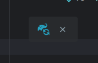

##### 4.4运行游戏

> 可以编译成.jar文件放进自己的客户端中使用
>
> 或者使用以下操作在IDEA中启动游戏

**找到右侧工具栏 按循序点击**

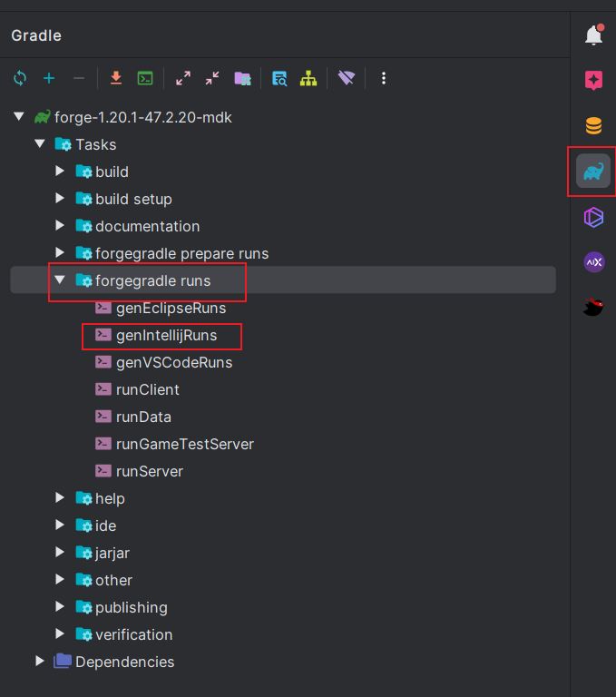

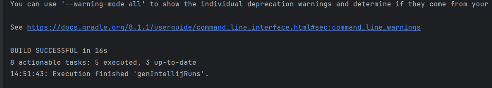

**找到上方的运行**

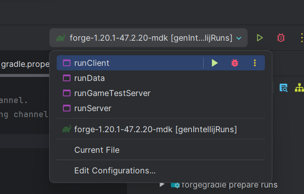

- runClient 运行客户端
- runData 运行数据生成
- runGameTestServer 运行游戏测试服务器
- runServer 运行服务器

选择runClient 点击debug运行

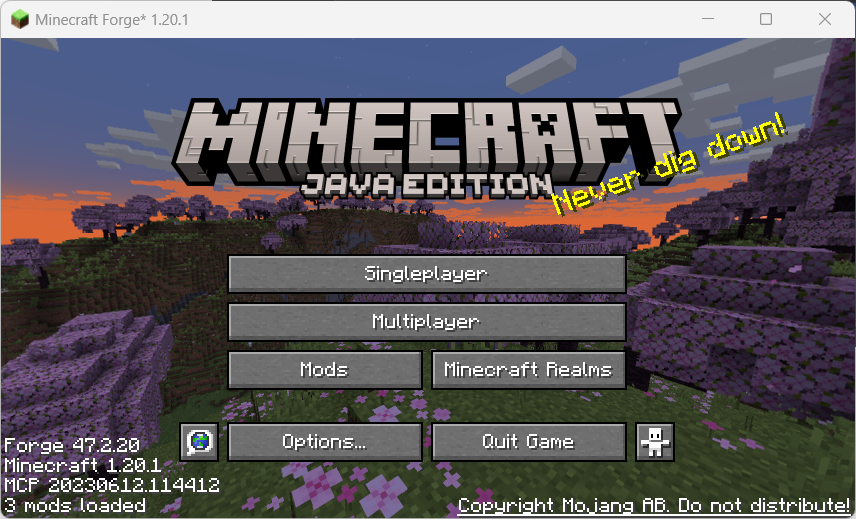

**点击mod查看创建的模组**

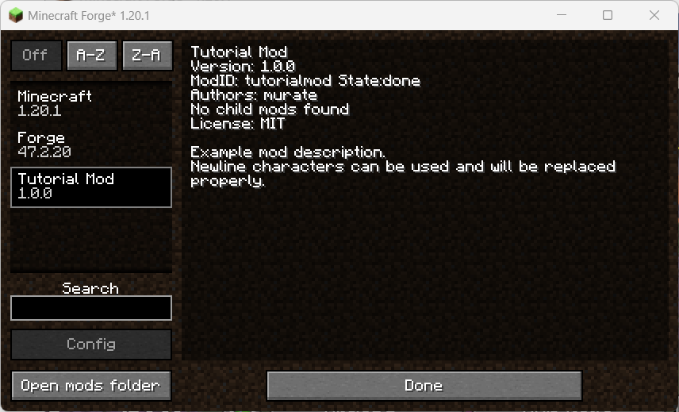

##### 4.5 其他设置

[Getting Started (parchmentmc.org)](https://parchmentmc.org/docs/getting-started)

###### 4.5.1

```json
 pluginManagement {
     repositories {
         maven { url = 'https://maven.parchmentmc.org' } // Add this line
     }
 }
```

**找到setting.gradle添加进去**

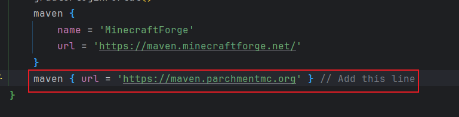

###### 4.5.2

```json
 plugins {
     // This should be below the net.minecraftforge.gradle plugin
     id 'org.parchmentmc.librarian.forgegradle' version '1.+'
 }
```

**找到build.gradle添加进去**

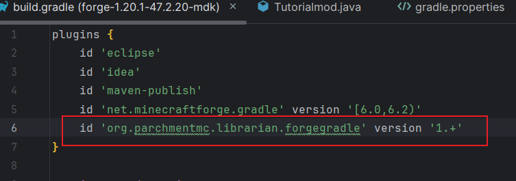

###### 4.5.3

```json
minecraft {
     mappings channel: 'parchment', version: '2023.9.03-1.20.1'
 }
```

**找到gradle.properties进行修改**

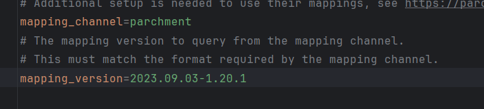

**修改完重新Load build**


## 二、创建自定义物品和创造选项卡

#### 1、新建物品

**在resources下创建assets有关的文件夹**

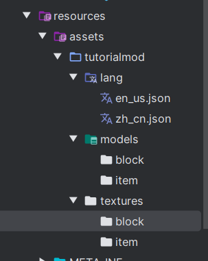

- **在com.你的名字.模组名字下面新建item文件夹**
- **在item文件夹下新建ModItems类**

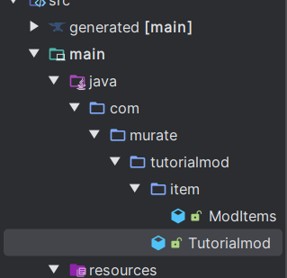

**ModItems.java**

```java
package com.murate.tutorialmod.item;

import com.murate.tutorialmod.Tutorialmod;
import net.minecraft.world.item.Item;
import net.minecraftforge.eventbus.api.IEventBus;
import net.minecraftforge.registries.DeferredRegister;
import net.minecraftforge.registries.ForgeRegistries;
import net.minecraftforge.registries.RegistryObject;

public class ModItems {
    public static final DeferredRegister<Item> ITEMS=							//物品注册表
            DeferredRegister.create(ForgeRegistries.ITEMS, Tutorialmod.MOD_ID); //注册物品，模组ID

    public static final RegistryObject<Item> SAPPHIRE = ITEMS.register("sapphire",
            ()-> new Item(new Item.Properties()));//新建物品
    
    public static  void register(IEventBus eventBus){ //总线，用于注册和处理
        ITEMS.register(eventBus);//将物品注册指定到总线中
    }
}
```

**在Tutorialmod类下添加**

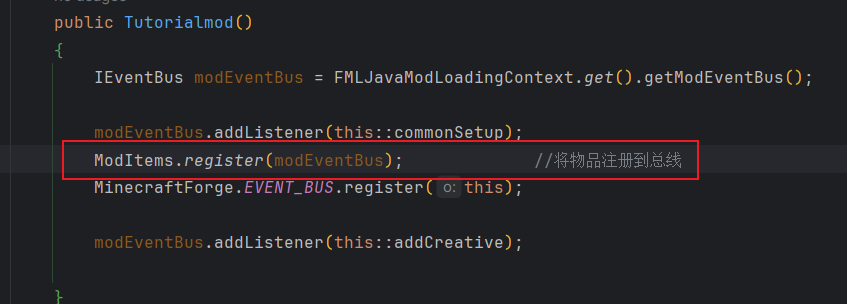

**物品已经注册到游戏里**

**赋予材质和添加语言**

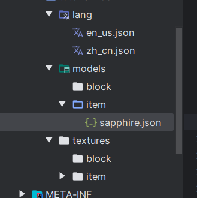

**在models/item下新建物品名.json**

```json
{
  "parent": "item/generated",
  "textures": {
    "layer0": "tutorialmod:item/sapphire"
  }
}
```

**将材质放在textures/item下	(材质名要与物品名相同)**


**en_us.json**

```json
{
  "item.tutorialmod.sapphire": "Sapphire"
}
```

**zh_cn.json**

```json
{
  "item.tutorialmod.sapphire": "蓝宝石"
}
```


**在Tutorialmod.java类的addCreative方法中添加**

```java
public void addCreative(BuildCreativeModeTabContentsEvent event) {
        if (event.getTabKey() == CreativeModeTabs.BUILDING_BLOCKS) { //添加到的标签
            event.accept(ModItems.SAPPHIRE); 						//被添加的物品
        }
    }
```


**启动游戏查看效果**

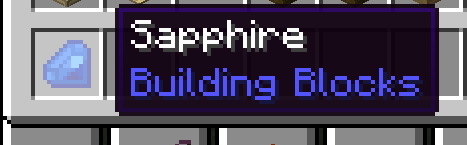


#### 2、设置创造选项卡

**在tutorialmod/item下创建ModCreativeModTabs类**

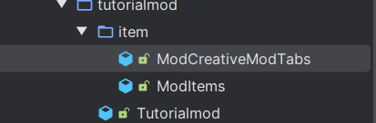

**ModCreativeModTabs.java**

```java
package com.murate.tutorialmod.item;

import com.murate.tutorialmod.Tutorialmod;
import net.minecraft.core.registries.Registries;
import net.minecraft.network.chat.Component;
import net.minecraft.world.item.CreativeModeTab;
import net.minecraft.world.item.ItemStack;
import net.minecraftforge.eventbus.api.IEventBus;
import net.minecraftforge.registries.DeferredRegister;
import net.minecraftforge.registries.RegistryObject;

import java.lang.reflect.Parameter;

public class ModCreativeModTabs {
    public static final DeferredRegister<CreativeModeTab> CREATIVE_MOD_TABS =
            DeferredRegister.create(Registries.CREATIVE_MODE_TAB, Tutorialmod.MOD_ID);//注册创造标签
    public static final RegistryObject<CreativeModeTab> TUTORIAL_TAB = CREATIVE_MOD_TABS.register("tutorial_tab",//将标签注册为tutorial_tab
            () -> CreativeModeTab.builder().icon(()->new ItemStack(ModItems.SAPPHIRE.get()))//创建 创造模式标签构建器，修改图标为Sapphire
                    .title(Component.translatable("creativetab.tutorial_tab")) //标签名
                    .displayItems((pParameters,pOutput)->{
                        pOutput.accept(ModItems.SAPPHIRE.get());//添加物品在这个标签里
                    })
                    .build());
    public static void register(IEventBus eventBus) {
        CREATIVE_MOD_TABS.register(eventBus);//将对象注册到总线中
    }
}

```

**给标签添加名字**

**en_us.json**

```json
{
  "item.tutorialmod.sapphire": "Sapphire",
  "creativetab.tutorial_tab":"Sapphire Tutorial Tab"
}
```

**zh_cn.json**

```json
{
  "item.tutorialmod.sapphire": "蓝宝石",
  "creativetab.tutorial_tab":"蓝宝石教程标签"
}
```


**回到Tutorialmod类**


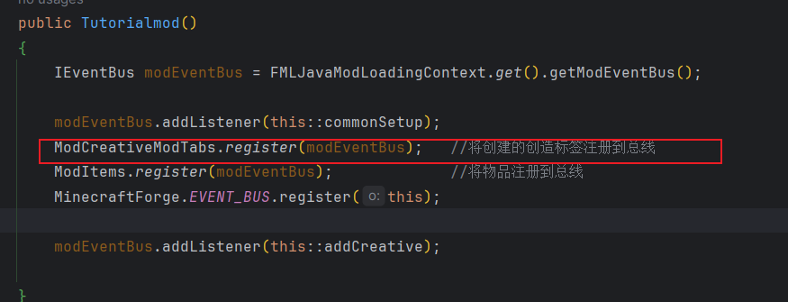

**将之前添加的物品注释掉**

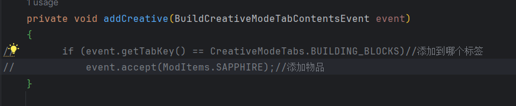

**启动游戏查看效果**

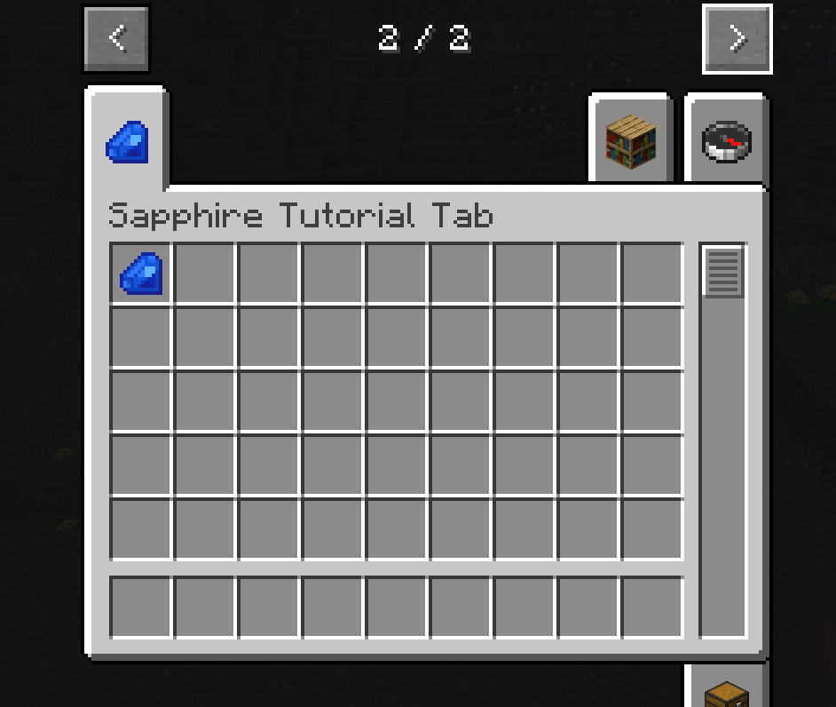

## 三、创建自定义方块

#### 新建方块

**在assets下创建blockstates文件夹**

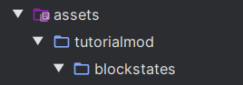

- **在com.你的名字.模组名字下面新建block文件夹**
- **在block文件夹下新建ModBlocks类**

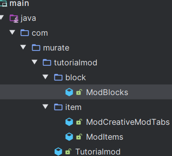

**ModBlocks.java**

```java
package com.murate.tutorialmod.block;

import com.murate.tutorialmod.Tutorialmod;
import com.murate.tutorialmod.item.ModItems;
import net.minecraft.world.item.BlockItem;
import net.minecraft.world.item.Item;
import net.minecraft.world.level.block.Block;
import net.minecraft.world.level.block.Blocks;
import net.minecraft.world.level.block.SoundType;
import net.minecraft.world.level.block.state.BlockBehaviour;
import net.minecraftforge.eventbus.api.IEventBus;
import net.minecraftforge.registries.DeferredRegister;
import net.minecraftforge.registries.ForgeRegistries;
import net.minecraftforge.registries.RegistryObject;

import java.util.function.Supplier;

public class ModBlocks {
    public static final DeferredRegister<Block> BLOCKS =                        //方块注册表
            DeferredRegister.create(ForgeRegistries.BLOCKS, Tutorialmod.MOD_ID);//注册方块，模组ID

public static  final RegistryObject<Block> SAPPHIRE_BLOCK = registerBlock("sapphire_block",
        ()->new Block(BlockBehaviour.Properties.copy(Blocks.IRON_BLOCK).sound(SoundType.AMETHYST)));//新建方块并赋予方块放置的声音也可以对其修改


    //注册方块并返回对象
    private static <T extends Block> RegistryObject<T> registerBlock(String name, Supplier<T>block){
        RegistryObject<T> toReturn = BLOCKS.register(name,block);
        registerBlockItem(name, toReturn);
        return toReturn;
    }
    //破坏掉落物获取掉落物本身
    private  static <T extends Block> RegistryObject<Item> registerBlockItem(String name,RegistryObject<T> block){
        return ModItems.ITEMS.register(name,()->new BlockItem(block.get(),new Item.Properties()));
    }
    public static void register(IEventBus eventBus) { //总线，用于注册和处理
        BLOCKS.register(eventBus);//将方块注册指定到总线中
    }
}

```

**在ModCreativeModTabs类中添加新建的方块**

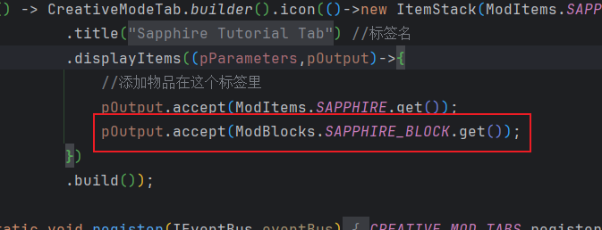

**此时游戏内已经有了新建的方块，接下来给方块添加材质**

**在assets/tutorialmod/blockstates、assets/tutorialmod/models/block以及item下新建三个sapphire_block.json**

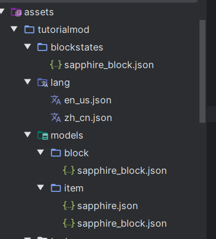

**blockstates 方块的不同属性状态**

**sapphire_block.json**

```json
{
  "variants": {
    "": {
    "model": "tutorialmod:block/sapphire_block"
    }
  }
}
```

**block 方块的模型**

**sapphire_block.json**

```json
{
  "parent": "minecraft:block/cube_all",
  "textures": {
    "all": "tutorialmod:block/sapphire_block"
  }
}
```

**item 方块的物品模型**

```json
{
  "parent": "tutorialmod:block/sapphire_block"
}
```

**将贴图文件添加进textures/block下**

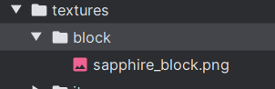


**启动游戏查看效果**

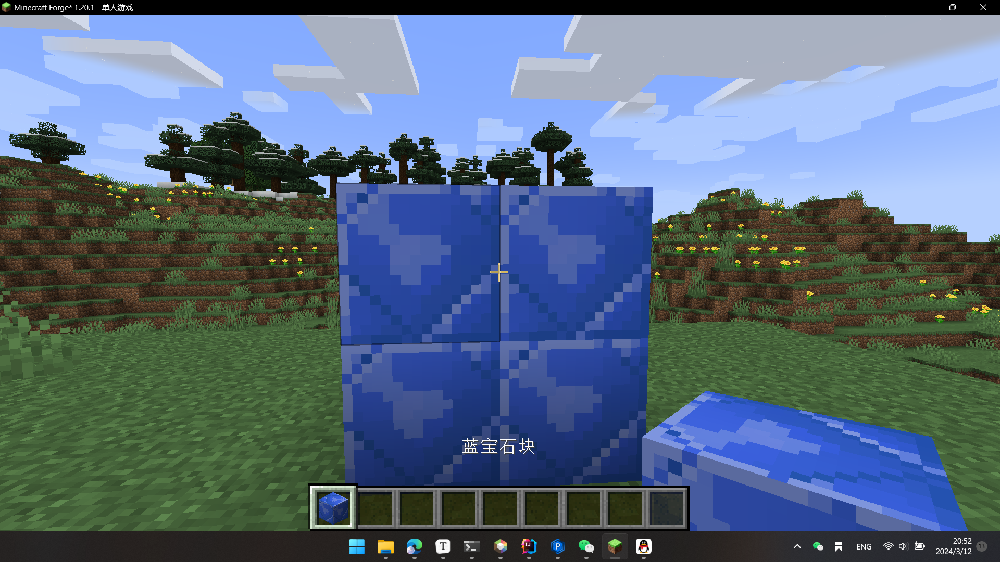
